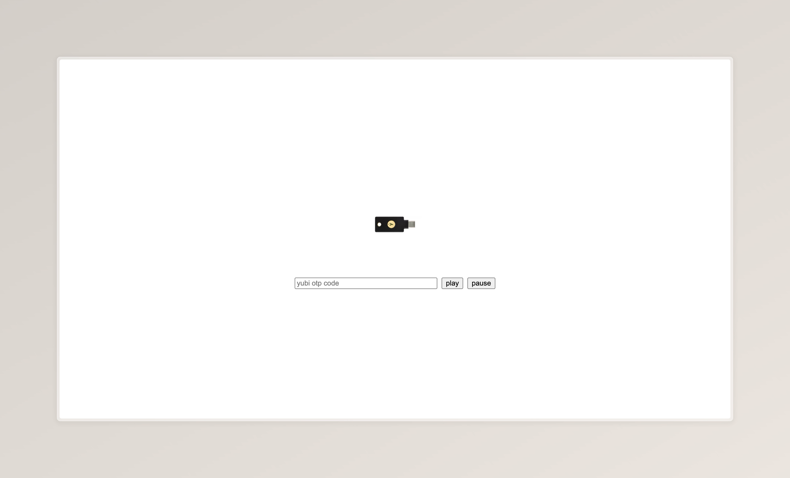

# yubikey makes music!

- do you like dnb?
- do you own a yubikey?
#### try out [yubidnb](https://moonlit-basbousa-1edb06.netlify.app/) :)

### how does it work?

1. you start here - you generate an otp in the input field.

2. seed generation - the otp string becomes the random seed for pattern generation. it's converted into a deterministic rng so the same seed produces the same beat.

3. creating the pattern - the seed generates drum patterns, sub-bass, stabs + fx using different algorithms:
   - drum patterns: created from hitmap data of drum breaks with two layers. 
   - sub-bass: follows the drums with a timing offset
   - fx & stabs: atmospheric hits spread out with randomised timing and pitch

4. sample loading - loads the samples into the audio engine. the system fetches the ogg audio files, decodes them into web audio buffers and stores them for quick playback :)

5. sequencing & playback - a 16th‑note sequencer schedules events in real time and plays the samples

made with <3 and :3 at shipwrecked by [@v1peridae](https://github.com/v1peridae) and [@scherepi](https://github.com/scherepi) !!

inspired by this on [github](https://github.com/apvilkko/dnb-generator)